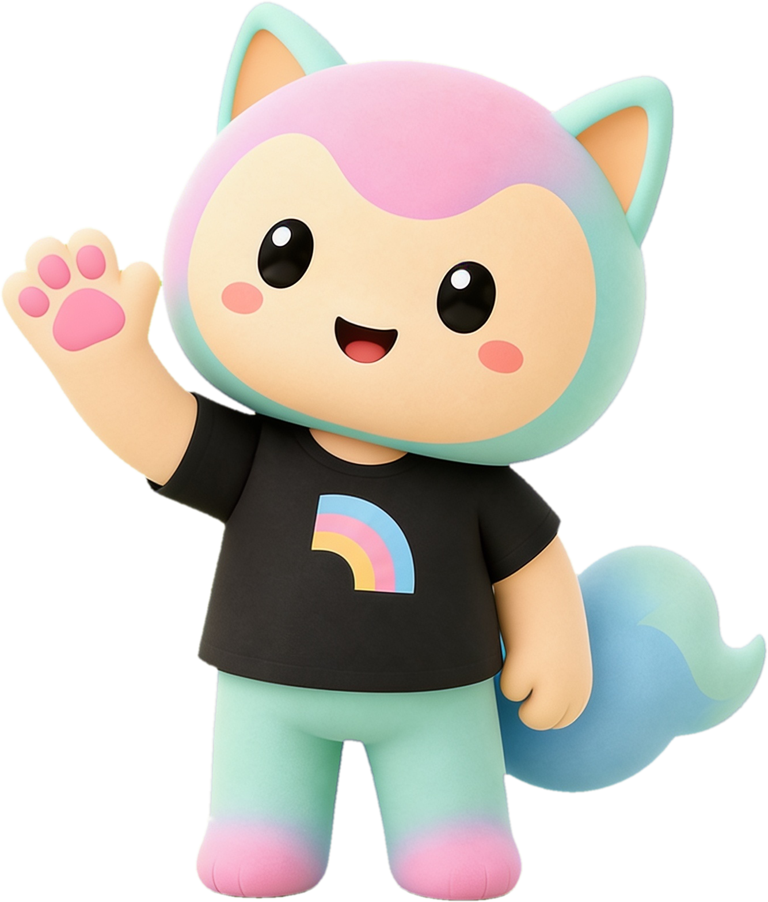

# Alano Mascot — reference kit

[](LICENSE)

## Why this exists

If you're vibe-coding a project, you've probably hit this:

- Coding-focused LLMs are great at logic, but bad at drawing — ask one for a
  vector mascot or icon set and you get something generic or off-model.
- You want a friendly, consistent brand character — for a chatbot persona, a
  virtual pet, an onboarding mascot, whatever — but don't know how to
  actually design and produce one.
- Even once you have a character, keeping it *consistent* across dozens of
  poses, moods, and screens is its own hard problem — one crooked ear or
  wrong shade of pink and it stops looking like the same character.

This repo is the answer: a set of Claude Code skills plus scripts that pin
every generation to a canonical reference image and a fixed style prompt, so
image/video models stay on-model instead of drifting. Point it at Alano to
use our mascot, or fork it and swap in your own reference art to keep *your*
character consistent.

## Meet Alano

Alano is a brand mascot: a plush cat with pink-and-mint gradient fur, teal
ears, rosy cheeks, and a black t-shirt with a small pastel rainbow. This repo
is the public reference kit for anyone who wants to generate on-brand Alano
artwork — including for commercial products (see [Licensing](#licensing)
below).

Most front-end devs can't draw a cat, and don't need to. Anchor on the root
images here, feed them to a modern image/video model as a reference, and you
get unlimited on-brand Alano poses, badges, and looping video for your site
or app.



## Bring Alano into your own project

The fastest way to actually use this kit inside your own app:

1. **Fork this repo** (or just download/copy it).
2. **Copy the whole folder into your own project** — e.g. as `alano-mascot/`
   at the root, or wherever fits your stack.
3. **Open your project in your AI coding agent** and ask it to study the
   `alano-mascot/` directory — starting with `README.md` and
   `.claude/skills/alano-brand/SKILL.md`.
   - Claude Code auto-loads skills from `.claude/skills/` wherever they live
     in the tree — that's a Claude-Code-native mechanism (frontmatter +
     description-matching + the `Skill` tool). Other agents (Cursor,
     Windsurf, etc.) don't auto-load them — point them at the same files
     manually; the content still works fine as plain reference docs, it just
     won't auto-trigger.
4. **Ask for advice.** Describe your app and ask which Alano mood, pose, or
   costume fits it — e.g. "I'm building a habit tracker, which Alano variant
   suits a streak-celebration moment?" The full catalogue of proven
   moods/costumes/props lives in `alano-brand/SKILL.md`.
5. **Ask it to generate a few stills** — specifically, to add an entry to the
   `STILLS` array in `scripts/generate-alano-images.mjs` and run it (see
   `alano-image-gen`), not to call an image API on its own. That's what keeps
   every generation anchored to the reference image and STYLE string instead
   of drifting off-model. This chat-driven flow is great for exploring a few
   poses; for bulk generation, running the script directly with
   `SEEDREAM_ONLY=id1,id2` is faster than a conversational loop. You'll need
   a `SEEDANCE_API_KEY` either way — see Requirements below.

## How it works — 30 seconds

1. **Never draw, never freestyle-prompt.** Every generation attaches a root
   image (`assets/root/alano-think.png`) as an image-to-image reference plus
   the canonical STYLE prompt string. That's what keeps the character on-model.
2. **Generate stills** with Seedream → `scripts/generate-alano-images.mjs`
3. **Generate looping clips** with Seedance → `scripts/generate-alano-videos.mjs`
4. **Finish clips** (square crop, seamless palindrome loop, poster, <600 KB)
   → `scripts/postprocess-alano-clips.mjs`
5. **Need transparency?** Generate on a flat backdrop, then remove it with
   `scripts/cutout_alano.py` — cream/white uses border flood-fill; a
   chroma-green backdrop (auto-detected) uses a global green mask + despill,
   which also handles green pockets enclosed by the character

### Requirements

- Node.js 18+ and Python 3.9+
- A BytePlus Ark API key with access to Seedream/Seedance, exported as
  `SEEDANCE_API_KEY` — get one from your BytePlus Ark console. This repo
  never ships a key; you must supply your own. Don't have one? Reach out to
  [Pursuit Li on Threads](https://www.threads.com/@pursuitli) or
  [Omu Labs](https://omulabs.co) — we're an authorized BytePlus partner and
  can offer a discount on standard Seedream/Seedance pricing.

### Not locked to one model

The technique here — anchor every generation to a reference image plus a
fixed style prompt — isn't Seedream-specific; it works with any model that
accepts an image reference. Alano is tuned and proven on Seedream/Seedance
today, but a few other models are worth knowing about if you're adapting
this pipeline:

- **OpenAI `gpt-image-1`** (via the Images API `edits` endpoint) accepts
  multiple input images for reference and can output a **native transparent
  background** (`background: "transparent"`) — worth trying as a shortcut
  around the whole `cutout_alano.py` step for that model. It's also
  generally stronger at in-image text than Seedream, so the "never trust the
  model for text" workaround in this skill may need less defensive
  cropping — test it rather than assuming the same failure mode carries
  over. (There's no separate `gpt-image-2` as of this writing — OpenAI's
  current image-gen line is `gpt-image-1`; treat any reference to a "2" as
  forward-looking, not a real model id to hardcode.)
- **Google's Gemini 2.5 Flash Image** ("Nano Banana") is arguably the most
  interesting fit for this project specifically: it's built for strong
  **subject/character consistency across turns** using conversational
  context and multi-image input, rather than needing a fresh reference
  image re-attached on every call. That's precisely the problem this repo
  works around by hand (root image + STYLE string) — it may be worth a
  side-by-side test to see whether it holds Alano on-model with a lighter
  prompt.

Swapping providers means changing the request builder in
`scripts/generate-alano-images.mjs` / `generate-alano-videos.mjs` to match
that API's shape — the reference-image discipline and STYLE string from
`alano-brand` still apply regardless of which model renders the pixels.

```bash
# API key is runtime-injected — NEVER committed to this repo.
SEEDANCE_API_KEY="<your key>" node scripts/generate-alano-images.mjs
SEEDANCE_API_KEY="<your key>" node scripts/generate-alano-videos.mjs
node scripts/postprocess-alano-clips.mjs
python3 scripts/cutout_alano.py output/stills/wave.png
```

## Skills (the actual guide)

The detailed how-tos live as Claude Code skills in [.claude/skills/](.claude/skills/) —
open this repo in Claude Code and they load automatically, or read them as docs.
Using a different agent (Cursor, Windsurf, etc.)? See
[Bring Alano into your own project](#bring-alano-into-your-own-project) —
you'll need to point it at these files yourself:

| Skill | What it teaches |
|---|---|
| [alano-brand](.claude/skills/alano-brand/SKILL.md) | The character, the canonical STYLE string, the hard rules. **Read first.** |
| [alano-image-gen](.claude/skills/alano-image-gen/SKILL.md) | Seedream image-to-image API, badges, sizes, the never-trust-model-text rule |
| [alano-video-gen](.claude/skills/alano-video-gen/SKILL.md) | Seedance tasks API, the loop-prompt suffix, model fallbacks |
| [alano-video-postprocess](.claude/skills/alano-video-postprocess/SKILL.md) | Palindrome loop trick, posters, size budget, scroll-scrub encoding |
| [alano-cutout](.claude/skills/alano-cutout/SKILL.md) | Flat-background generation + border flood-fill → transparent cutouts |

## What's in `assets/`

| Path | What it is |
|---|---|
| `root/alano-root.png` | **THE root Alano** — 1334×1564 transparent RGBA, waving pose. Regenerated with Seedream 4.5 on a chroma-green backdrop and cut out with the chroma pipeline, so it has clean edges (no white halo). |
| `root/alano-root-green.png` | The green-backdrop source of the root — keep it; regenerating the root cutout starts here |
| `root/alano-think.png` | Canonical image-to-image reference — attach to every API request |
| `root/badge-ref.png` | Style reference for medallion coin badges |
| `stills/` | Sample generated stills (Seedream output: idle, celebrating, wave) |
| `cutouts/` | Sample transparent cutout (`wave-cutout.webp`) made by `cutout_alano.py`. For the cleanest example of a cutout, look at `root/alano-root.png` itself — it's the chroma-green pipeline output with no edge halo. |
| `badges/` | Sample finished badge (shipped WebP) |
| `video/raw/idle.mp4` | A raw Seedance clip, straight from the API (before finishing) |
| `video/idle.mp4` + `idle.webp` | The same clip finished: 480×480 palindrome loop + poster |
| `video/celebrating.mp4` | A finished no-palindrome clip (directional motion) |
| `video/kimono-peek.mp4` | Regional variant example (Japan product) — same pipeline, different wardrobe |

## Using clips on a page

```html
<video src="/alano/idle.mp4" poster="/alano/idle.webp"
       autoplay muted loop playsinline width="240" height="240"></video>
```

Clips are rendered on the page's light background color — play them as plain
rectangles; don't try to chroma-key video. For transparent art, use the still
cutouts.

## Rules

- **No API keys in this repo, ever.** Scripts exit unless `SEEDANCE_API_KEY`
  is set in the environment.
- Alano stays pastel; accent colors belong to your layout, not the cat.
- No text in generated images — composite real text locally.
- Masters are PNG, shipped copies are WebP/MP4. `output/` is git-ignored.

## Contributing

Issues and PRs are welcome — new poses, better cutout edge cases, additional
regional variants, and pipeline fixes are all in scope. Please keep new
generations on-model by following the `alano-brand` skill and attaching the
canonical reference image; off-model art won't be merged.

## Licensing

This repo bundles two different things, under two different licenses:

- **Code** (scripts, skills, docs) — [MIT](LICENSE). Use, modify, and
  redistribute freely, including commercially.
- **Alano brand & assets** (the character design and everything under
  `assets/`) — the **Free Mascot License**, below. Alano Tech Pte. Ltd.
  keeps copyright, trademark, and ownership of the character; you get broad,
  free, commercial usage rights.

### Free Mascot License

Alano Tech Pte. Ltd. retains **copyright, trademark, and IP ownership** of
the Alano character. Subject to that, anyone is free to:

- ✅ Use Alano in **commercial products**
- ✅ Use Alano in **indie apps and side projects**
- ✅ Use Alano in **AI products** (chatbots, agents, virtual pets, etc.)
- ✅ Use Alano at **hackathons**

You may **not**:

- ❌ **Resell** Alano assets themselves (as a standalone asset pack, template,
  or stock library)
- ❌ **Claim you created** the Alano character
- ❌ Mint or sell Alano as an **NFT**
- ❌ Use Alano in **offensive, hateful, or illegal** contexts

This license does not transfer ownership of the character or grant any
right to imply endorsement by or partnership with Alano Tech Pte. Ltd.

## Where Alano ships today

- **[Alano.ai](https://alano.ai)** — where Alano was born: an AI-native CRM,
  made permanently free for founders and small teams
- **Big Five Test** — [bigfivetest.app](https://bigfivetest.app) (web),
  [bigfivetest.omulabs.co](https://bigfivetest.omulabs.co) (mobile apps) — a
  personality assessment app built on the Big Five (OCEAN) model, with Alano
  guiding you through the test and reacting to your personality type
- **Japan Cat** — [japancat.co](https://japancat.co) (web),
  [japancat.omulabs.co](https://japancat.omulabs.co) (mobile apps) — a
  gamified Japanese-language learning app, with Alano as your study
  companion celebrating streaks and milestones along the way

## Credits

Alano belongs to **Alano Tech Pte. Ltd.** and was invented by **Pursuit Li**
— follow [@pursuitli on Threads](https://www.threads.com/@pursuitli) for the
latest updates and releases.
